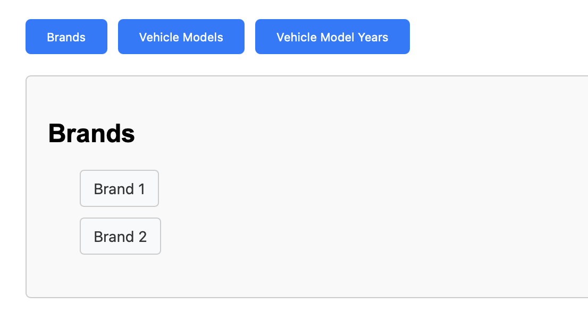
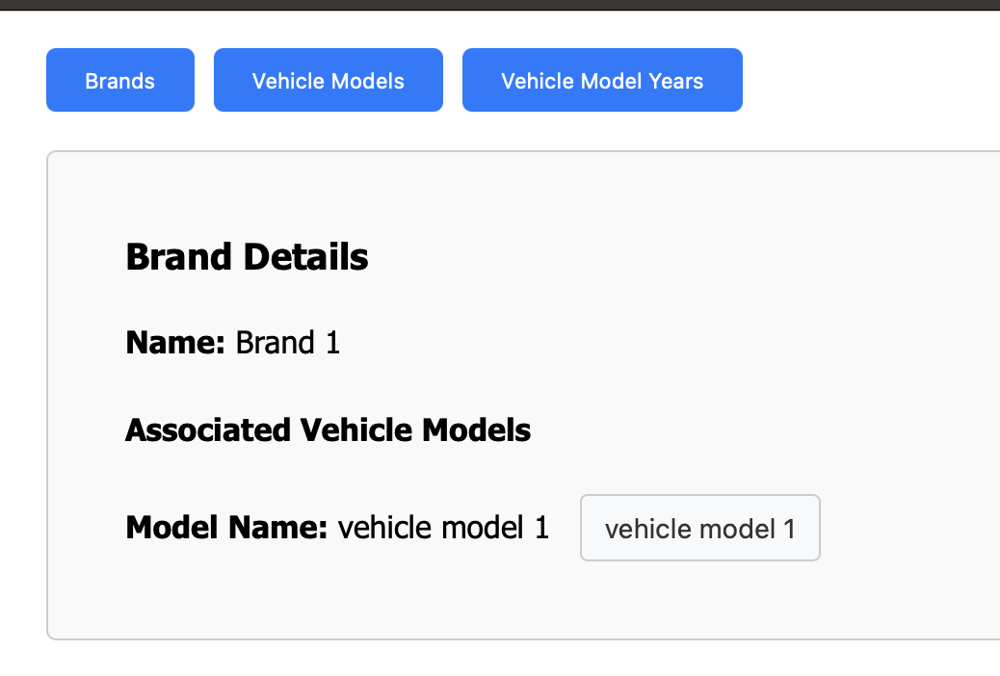
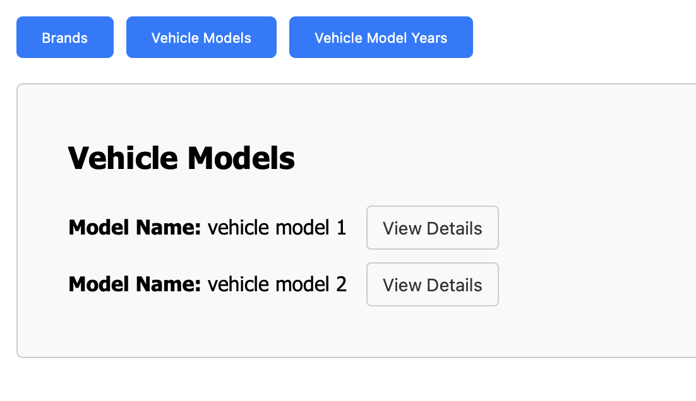
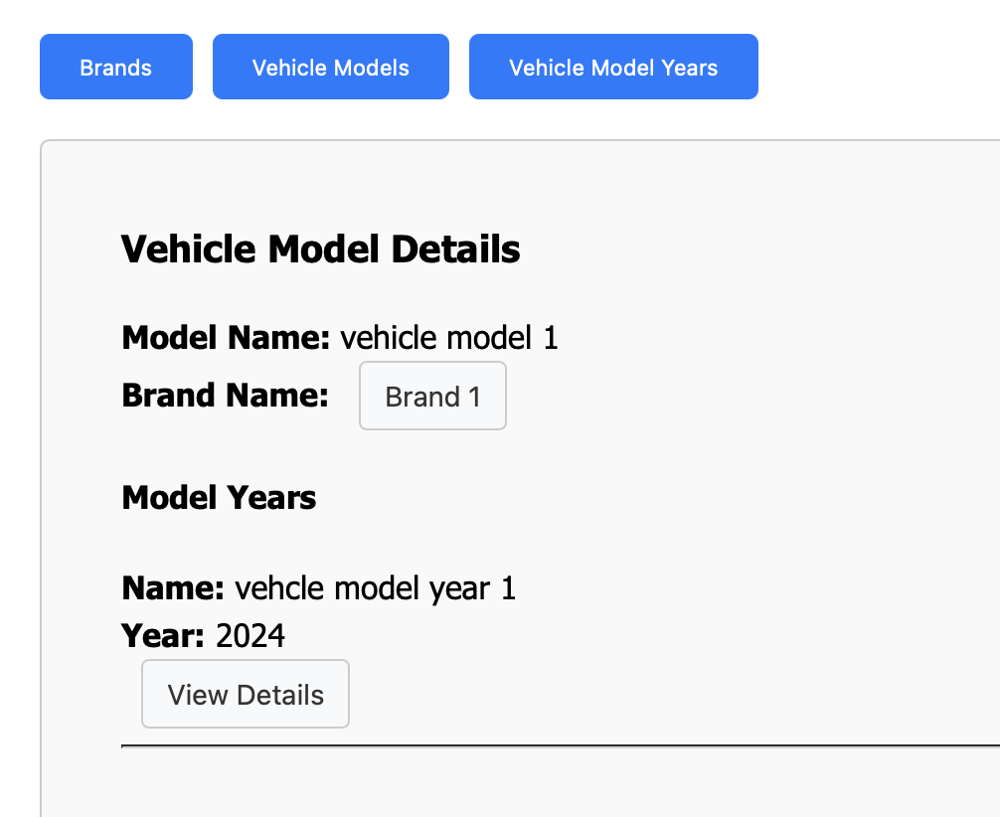
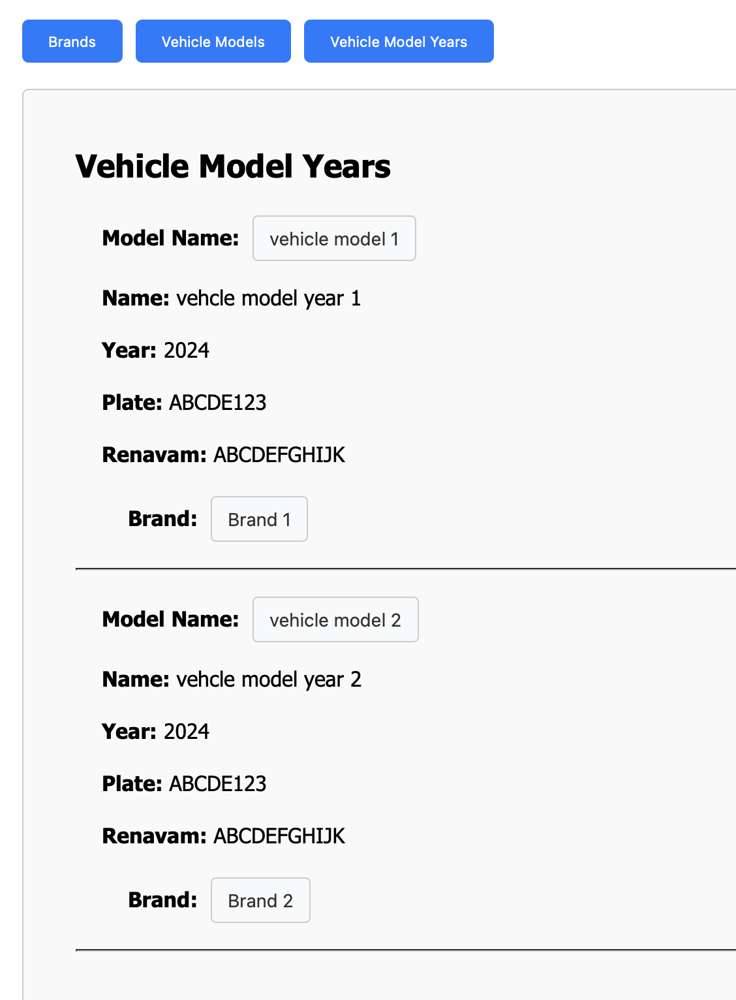
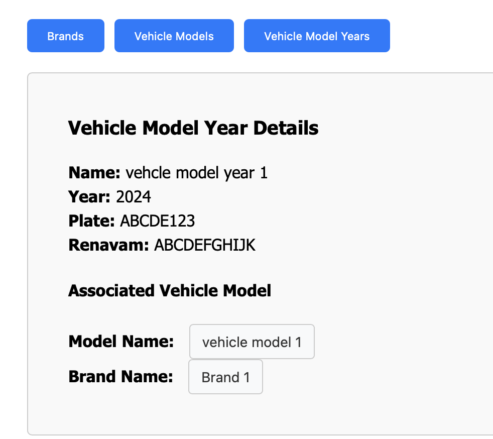

# Infosistemas Frontend Desafio Técnico

## Rotas

- **`/brands`**: Exibe a lista de marcas.  
  Componente: `BrandsComponent`  
  Imagem:  
  

- **`/brands/:id`**: Exibe os detalhes de uma marca específica.  
  Componente: `BrandsDetailsComponent`  
  Imagem:  
  

- **`/vehicle-models`**: Exibe a lista de modelos de veículos.  
  Componente: `VehicleModelsComponent`  
  Imagem:  
  

- **`/vehicle-models/:id`**: Exibe os detalhes de um modelo de veículo específico.  
  Componente: `VehicleModelsDetailsComponent`  
  Imagem:  
  

- **`/vehicle-model-years`**: Exibe a lista de anos de modelos de veículos.  
  Componente: `VehicleModelYearsComponent`  
  Imagem:  
  

- **`/vehicle-model-years/:id`**: Exibe os detalhes de um ano de modelo de veículo específico.  
  Componente: `VehicleModelsYearDetailsComponent`  
  Imagem:  
  

- **Redirecionamento**: Quando a URL não é reconhecida, o usuário é redirecionado para a página de marcas (`/brands`).

## Dependências e Configuração

### Ambiente de Desenvolvimento
1. Instalar as dependências:
    ```bash
    npm install
    ```

2. Defina a URL do servidor back-end:
    ```bash
    cp .env.example .env
    ```

3. Executar o servidor de desenvolvimento:
    ```bash
    ng serve
    ```

**Importante**: O servidor [back-end](https://github.com/The-Kevin/infosistemas) deve estar em pleno funcionamento antes de iniciar este projeto!

### Ferramentas
- **Angular CLI**: Usado para rodar o servidor e construir o projeto.
- **Angular Router**: Gerencia as navegações entre as páginas de marcas, modelos de veículos e anos de modelos.

### Problemas de Desenvolvimento
Infelizmente, não tive tempo para criar um template com melhor visual ou melhorar as listagens com paginação e ordenação. Caso seja estritamente necessário para aprovação do desafio, por favor me avise e criarei o que falta.
